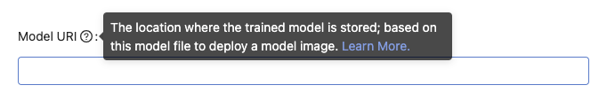

## 🌟 &NonBreakingSpace; What's New

### Models Management (Beta)

Want to compare your trained models or give every single model a unique version? You can now visit the PrimeHub Model Management to analyze the experiments, to manage the trained models, and further to deploy the best model to PrimeHub Model Deployment.

+ [Document](model-management)

## 🚀 &NonBreakingSpace; Improvements

### In-app product guide

Users, sometimes, are lost in terms on interface. Don't bother looking around documentation now, we presented a new assistance UI in the PrimeHub, you can obtain brief descriptions and access to detailed document on every pages by "Learn More". Significantly mitigate the learning efforts while using the PrimeHub features. Just hover over it, you will find the way out.

## 🧰 &NonBreakingSpace; Bug Fixes

## 💫 &NonBreakingSpace; More Things

+ **Apps (Beta)**, PrimeHub Apps is continually to extend MLOps integration universe, with adding few [built-in Apps more](primehub-app-builtin-code-server) you can easily access Code Server, Matlab, Label Studio, MLflow, and Streamlit now. Allowing users to orchestrate data/tools for the acceleration of ML workflow. Besides, few tutorials are published as well, such as [Create Your Own App](primehub-app-tutorial-template) if built-in Apps don't meet your needs.

---

## 🎪 &NonBreakingSpace; In the Community

+ [PrimeHub Community Edition v3.6](https://github.com/InfuseAI/primehub/releases) &neArr;

+ [MLOps Taiwan x Facebook](https://www.facebook.com/groups/mlopstw/) &neArr;

+ [InfuseAI x Youtube](https://www.youtube.com/channel/UCbbRUfqKPWfZxZY62Pian-g) &neArr;
