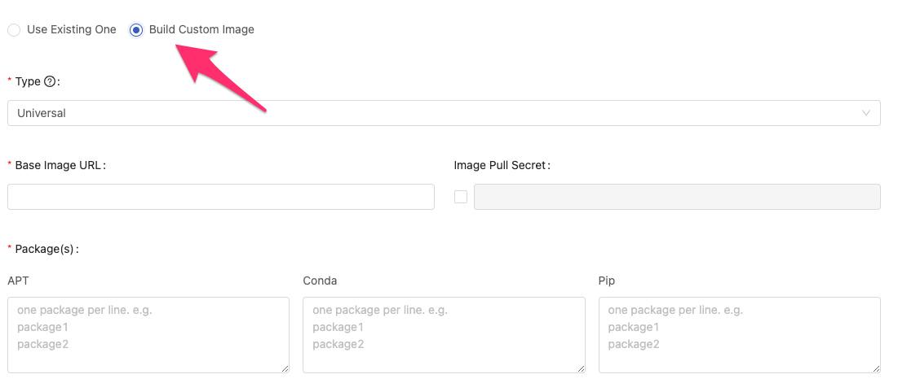

## 🌟 &NonBreakingSpace; What's New

### 1-Click Installation on AWS

Are you AWS users? If you are 🎉, you luckily can enjoy the pleasing 1-click easy installation on AWS. With AWS account you can hand on fully-featured PrimeHub Enterprise with default license(1 group/1 deployment) in 30mins. Visit [one.primehub.io](https://one.primehub.io) for the *click*.

## ❣️ &NonBreakingSpace; Breaking Changes

### Images (Admin Portal) incorporates Custom Image Build

Since the release of Images (Group Admin), we have some good feedback regarding the 2-in-1 design(Use existing One & Build Custom Image). We are glad to announce Images(Admin Portal) adopting the same 2-in-1 design, Administrators now can manage/build images more easily in one place.

## 🚀 &NonBreakingSpace; Improvements

+ All of us agree with the card style of Apps look great. So we re-designed the Deployments page with the same style
  
  

+ Rephrased secret type: *Git Dataset* (~~Opaque~~), *Image Pull* (~~kubernetes.io/dockerconfigjson~~)
  
  

+ PHFS viewer supports Jupyter Notebook; you can view *.ipynb* file without launching a Notebook
  
  

+ PrimeHub App: Streamlit supports external package dependency
+ Platform administrators who are not Group Admin are able to access Group Admin features for every group
+ Enhanced the UX of the Maximum Deployments component
+ Updated PrimeHub Extension with Papermill v2.3.3
+ Updated cudnn version to keep pace with Cuda 11

## 🧰 &NonBreakingSpace; Bug Fixes

+ Fixed: Deployments update action is not checked by the maximum deployments
+ Fixed: Deployed Deployment is not able to be updated due to the maximum deployment is achieved.
+ Fixed: Maximum deployment counts stopped deployments in.

## 💫 &NonBreakingSpace; More Things

+ Upgraded Helm from v3.3.4 to 3.6.2

+ End-to-end tutorial part4: [Build the Web App by Streamlit](primehub-end-to-end-tutorial-4)

### PrimeHub Python SDK

PrimeHub Python SDK is the PrimeHub Platform Software Development Kit (SDK) for Python, which allows Python developers to make the  software that makes use of services like Job and Deployment.

GitHub: [PrimeHub Python SDK&neArr;](https://github.com/InfuseAI/primehub-python-sdk)

## 🌇 &NonBreakingSpace; Deprecation

+ Maintenance Notebook (Admin Portal)
+ Image Builder (Admin Portal)

---

## 🎪 &NonBreakingSpace; In the Community

+ [PrimeHub Release](https://github.com/InfuseAI/primehub/releases) &neArr;

+ [Ways of doing ML](https://waysof.ml) &neArr;

+ [MLOps.toys](https://mlops.toys/) &neArr;

+ [MLOps Taiwan x Facebook](https://www.facebook.com/groups/mlopstw/) &neArr;

+ [InfuseAI x Youtube](https://www.youtube.com/channel/UCbbRUfqKPWfZxZY62Pian-g) &neArr;
