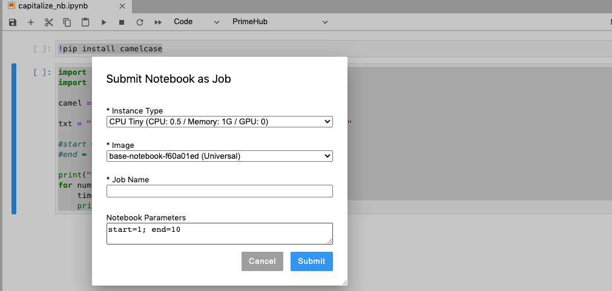

## 🌟 What's New

### Usage Report

As an admin, download monthly resource usage information at a summary and detailed level in .csv format.

+ [Document](guide_manual/admin-report)

### Job Artifacts

We've streamlined the sharing of information between groups by allowing users to view and download all artifacts associated to a job.

+ [Document](job-artifact-feature)

### PrimeHub Notebook Extension

#### Submit Notebooks as Job

Tired of going back and forth between PrimeHub and your Jupyter notebook? Worry no more, and submit your job directly from your notebook in a few simple clicks with our new JupyterLab extension.

### Server to Server

Nothing is holding you back from using PrimeHub--not even an air-gapped environment. Leverage a server-to-server connection with an internal-signed https certificate.

+ [Document](getting_started/configure-self-signed-ca)

## 🦄 Breaking Changes

## 🚀 Improvements

## 🧰 Bug fixes

---

## 🎪 In the Community

+ [PrimeHub CE v3.1 (Community Edition) Release](https://github.com/InfuseAI/primehub/releases)

+ [InfuseAI x Youtube](https://www.youtube.com/channel/UCbbRUfqKPWfZxZY62Pian-g)