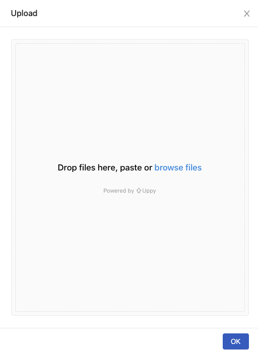

## 🌟 What's New

### Group Admin

We are introducing a new role: the Group Administrator! Group Admin has the privilege to access dedicated features from User Portal, such as Images.

+ [Document](guide_manual/admin-group#members)

### Images

The Group Admin has the ability to create, view, update, and delete images for a group.

+ [Document](group-image)

### Shared Files: Upload

Upload your files to your group's shared space in the Shared Files tab so that anyone from your group can use it. Stay tuned for our next release (3.4)—we plan to include a browser so that you can easily find the files you need within your group. 

+ [Document](shared-files)

### Models (Beta)

We wanted to simplify your experience in building and pushing models to fit in with your sleek workflow. Now, you can train and deploy a Tensorflow 2, PyTorch, SKLearn models in PrimeHub without even needing to build an image.

In beta we introduce two ways for the model deployment.

+ [Deploy a Model by Pre-packaged Server](model-deployment-tutorial-prepackaged-image)

+ [Deploy a Model by Image built from Language Wrapper](model-deployment-tutorial-model-image)

+ [Tutorials](model-deployment-tutorial-concepts)

### Notebook Logs

Notebooks, sometimes, are failed to spawn or run into troubles because user programs/environments. Now users are able to investigate failures and shoot troubles from logs of **Notebook Logs**.

+ [Document](quickstart/launch-project#notebook-logs)

## 🚀 Improvements

## 🧰 Bug Fixes

## 💫 One More Thing

### NVIDIA DXG A100 Support Verified

NVIDIA has released A100 Tensor Core GPU with latest [MIG technology](https://www.nvidia.com/en-us/technologies/multi-instance-gpu/). A100 supported by PrimeHub has been verified and confirmed.
  
---

## 🎪 In the Community

+ [PrimeHub CE v3.3 (Community Edition) Release](https://github.com/InfuseAI/primehub/releases)

+ [MLOps Taiwan on Facebook](https://www.facebook.com/groups/mlopstw/)

+ [InfuseAI x Youtube](https://www.youtube.com/channel/UCbbRUfqKPWfZxZY62Pian-g)
