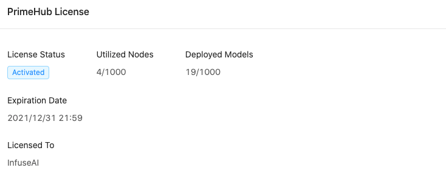

> 3.4 Release Candidate Note

## 🌟 &NonBreakingSpace; What's New

### Build Custom Image

Group administrators can now build new custom images for their managed groups. From the Images tab, they can create custom images by installing packages to already existing base images.

+ [Document](group-image)

### Shared File: Browse

Want to share your project files with your group-mate? Wish to share and find your group files in one place? You can now visit the Shared Files tab in PrimeHub and browse through, view, and download your groups' project files.

+ [Document](shared-files)

### License warning

When your PrimeHub usage has surpassed your license (such as Expiration Date, Maximum Nodes, Maximum Models), you will now see a warning banner to notify you to change your contract. To contact our sales team, please email business@infuseai.io.

+ [Document](guide_manual/admin-system#primehub-license)

## 🚀 &NonBreakingSpace; Improvements

## 🧰 &NonBreakingSpace; Bug Fixes

## 💫 &NonBreakingSpace; One More Thing

+ **MATLAB** image: we provide PrimeHub-compatible MATLAB environment image. See [How to launch MATLAB environment on PrimeHub](tasks/matlab-img).

---

## 🎪 &NonBreakingSpace; In the Community

+ [PrimeHub Community Edition v3.4](https://github.com/InfuseAI/primehub/releases) &neArr;

+ [MLOps Taiwan x Facebook](https://www.facebook.com/groups/mlopstw/) &neArr;

+ [InfuseAI x Youtube](https://www.youtube.com/channel/UCbbRUfqKPWfZxZY62Pian-g) &neArr;
