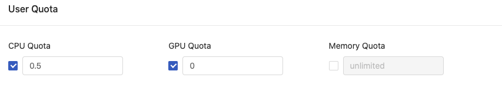

Resources such as CPU, GPU, Memory are shared among multiple users and multiple groups. PrimeHub, a multi-tenant platform, provides quotas control of valuable resources against groups and users that it can prevent groups/users from utilizing significant amount of resources.

These quota settings can be adjusted in [Groups Management](guide_manual/admin-group#user-quota).

## Group Quota

By setting the group quota of a specific group, the sum of requested/allocated resources by all of group members cannot exceed the limitation. If a new resources request from group members will cause the exceedance of group quotas, the request will be rejected.

## User Quota

By setting the user quota of specific group, a group member cannot request resources more than the user quota. The request will be rejected. And if the request will cause the exeedance of group quotas, the request will be rejected as well.

Since a user can be associated with multiple groups, switching working groups can have a user different user quotas from different group accordingly.

