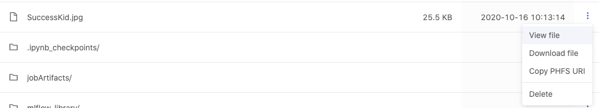
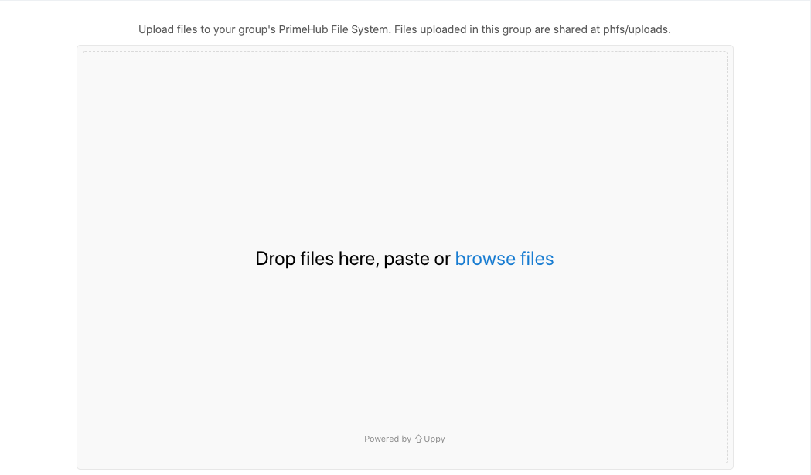
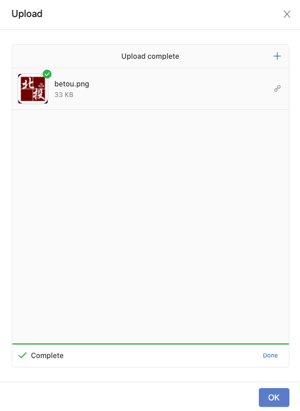
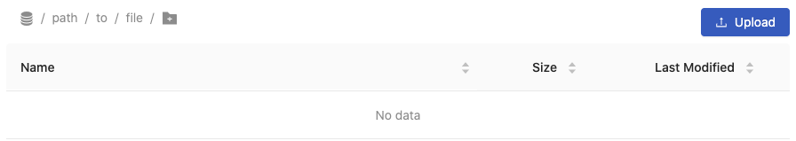

  
Enterprise
    Applicable to Enterprise Edition
  

  
Community
    Applicable to Community Edition
  

 

**Shared Files** feature is based on [PHFS Storage](quickstart/nb-data-store#phfs-storage). Group members are able to browse uploaded files and to upload files for sharing with others within the same group.

## Browse

It lists files and directories with columns of `Name`, `Size`, and `Last Modified`. The list can be sorted by these columns.

+ `<Directory>/`: navigate into the directory by clicking it.

+ `<File>`: there are actions we can perform over files.
  
  

  + `View`: view the file in an new tab if the file format is supported. E.g. image, text.
  + `Download file`
  + `Copy PHFS URI`: URI looks like `phfs:///<path/to/file>` (triple `/`); copy the URI of the file, use it in jobs.
  + `Delete`

## Upload

Click `Upload` to pop up a uploader.

Drop files, paste or click `Browse files` to start uploading files.

Click `OK` to finish the uploading or click `Done`/`+` to upload additional files.

> Uploaded files can been only accessed by same group; please confirm the selected working group if files are not listed.

### Create directory

Click the icon, then input the name of sub-directory, press `Enter`. 

or even a path like `path/to/file`, press `Enter`.

Then upload files.

> The nested directories won't be created until a file is uploaded into, in other words, if `No data`, nested directories won't be created.
