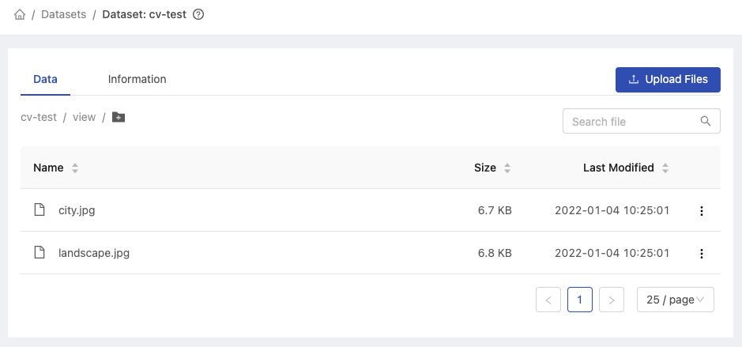

  
Enterprise
    Applicable to Enterprise Edition
  

  
Community
    Applicable to Community Edition
  

    
Deploy
    Applicable to Deploy Edition
  

 

The **Shared Files** feature is based on [PHFS Storage](quickstart/nb-data-store#phfs-storage) to store shared files. Group members are able to browse shared files and able to upload files for sharing with other group members.

## Browse

It lists files and directories with columns of `Name`, `Size`, and `Last Modified`. The list can be sorted by these columns.

+ `<Directory>/`: navigate into the directory by clicking it.

  > Some directories are created by PrimeHub automatically, such as  `jobArtifacts/`.

+ `<File>`: there are actions we can perform over files.
  
  

  + `View file`: view the file in an new tab if the file format is supported. E.g. image, text and notebook(*.ipynb*).
  + `Download file`
  + `Copy PHFS URI`: URI looks like `phfs:///<path/to/file>` (triple `/`); which can be used in Jobs.
  + `Delete`

## Upload

Click `Upload` to pop up an uploader.

Click or drag files to start uploading them.

During uploading, the progress bar will show the progress of uploading.

We can click `Upload in Background` to move the uploading action to the background.

Once the uploading is done, the file will be listed in the `Shared Files` page.

Click `OK` to close the dialogue or click/drag to upload additional files.

> Uploaded files can been only accessed by same group; please confirm the selected working group if files are not listed.

### Create directory

Firstly, click the `+` icon.

Then input the name of sub-directory and click `Confirm`.

Example of typing the `path/to/file`.

> The nested directories won't be created until a file is uploaded into, in other words, when showing `No data`, at this moment, no directories is created yet.

## Create/Update a Dataset

The `Shared Files` is the whole files storage and the [Datasets](datasets) is the specified collection of files that based on the `Shared Files`.

We can directly choose some files or directories from the `Shared Files` list, it will pop-up dialogue to `Create new dataset` or `Add to existing dataset`.

### Create new dataset

Select `Create new dataset`, it will pop-up dialogue and we can input the `Dataset Name`, specify `Tags`, and view the file contents.

  + `Dataset Name`: name of the dataset.
  + `Tags`: tags of the dataset.
  + `Contents`: the file contents of the current creation.

After specifying the values, click `Create Dataset`.

The dataset `image-test` is created successfully.

### Add to existing dataset

In addition to creating a new dataset from the `Shared Files`, we can also add the files to an existing dataset.

Select `Add to existing dataset`, it will pop-up dialogue and we can select the existing dataset and view the file contents.

View selectable datasets. Here we select `cv-test`.

We can add files to the `cv-test` dataset directly or even add a sub-directory to the `cv-test` dataset by clicking the `Add folder`.

Input the sub-directory name `view` and click `Confirm`.

Ensure the update location and file contents are correct, click `Add files to Dataset`.

The dataset `cv-test` is updated successfully.

